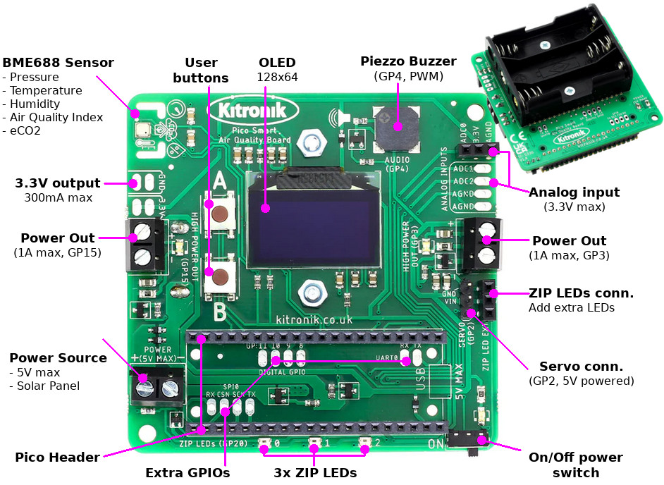

Other Languages: [FRANCAIS](README_FR.md)

# Kitronik-Pico-Smart-Air-Quality-Board-MicroPython



A module and sample code for the Kitronik Smart Air Quality Board for the Raspberry Pi Pico. (www.kitronik.co.uk/5336)

To use, save the PicoAirQuality.py file onto the Pico so it can be imported.  
There are several classes within the module for accessing and controlling the different board features.  
## Import PicoAirQuality.py and construct instances of the differenet classes:
```python
    from PicoAirQuality import KitronikBME688, KitronikOLED, KitronikRTC, KitronikZIPLEDs, KitronikBuzzer, KitronikDataLogger, KitronikOutputControl, KitronikButton

	bme688 = KitronikBME688()    # Class for using the BME688 air quality and environmental sensor
	oled = KitronikOLED()    # Class for using the OLED display screen
	rtc = KitronikRTC()    # Class for using the built-in Pico Real-Time Clock (RTC)
	zipleds = KitronikZIPLEDs(3)    # Class for using the ZIP LEDs (on-board and external connections)
	buzzer = KitronikBuzzer()    # Class for using the piezo buzzer
	log = KitronikDataLogger("data_log.txt", "semicolon")    # Class for using the built-in Pico file system for data logging
	output = KitronikOutputControl()    # Class for using the high-power and servo outputs
	buttons = KitronikButton()    # Class for using the input buttons
 ```
Below are explanations of the functions available in each class.  

## KitronikBME688
The BME688 sensor is the main feature of the board, enabling measurements of:  
* Temperature
* Pressure
* Humidity
* Index of Air Quality (IAQ)
* Estimated CO2 (eCO2)

Class instantiation reads and sets up all the calibration parameters for different calculations, creates all the class variables and sets up the default settings on the BME688 sensor.  
After this process, the temperature, pressure and humidity sensors will be able to be used immediately, but the gas sensor - which provides the IAQ and eCO2 outputs - needs some further setup:  
```python
bme688.setupGasSensor()
bme688.calcBaselines()
```
These functions set the temperature and 'on' time for the gas sensor plate, and then run a 5 minute process measuring gas resistance and ambient temperature and then calculating mean values - these are then used as baselines for future calculations.  
To actually run the measurement process, call:  
```python
bme688.measureData()
```
This function will take readings from all the sensor outputs and run any required compensation calculations, but further functions are needed for extracting the final values in a useable format:  
```python
bme688.readTemperature(temperature_unit="C")    # The default unit is degC, but can be changed to degF by calling "F".
bme688.readPressure(pressure_unit="Pa")         # The default unit is Pascals ("Pa"), but can be changed to millibar by calling "mBar".
bme688.readHumidity()       # Outputs relativy humidity as a %.
bme688.readeCO2()       # An estimated value based on gas resistance, temperature and humidity - outputs a value in parts per million (ppm).
bme688.getAirQualityPercent()   # A relative value based on gas resistance and humidity - outputs as a %.
bme688.getAirQualityScore()     # A relative value based on gas resistance and humidty - outputs as a value on a 0 - 500 scale, where 0 = Excellent and 500 = Extremely Poor
```

## KitronikOLED
The OLED screen provides a way for adding useful visual outputs to programs and projects. The screen can display text, numbers, lines, shapes and simple graphs.  
Class instantiation sets up the default settings for the screen, including the correct orientation for the Pico being at the bottom edge of the board.  
To display text (or numbers converted to strings with the 'str(*numbers*)'):  
```python
oled.displayText(text, line, x_offset=0)
```
The text can be displayed on any of the 6 lines (1 - 6), with up to 16 characters per line. Text will default to start showing on the left edge of the screen, but by setting an 'x_offset' by a certain number of pixels it can start anywhere across the screen (the screen is 128px wide).

**Note:** If the text is too long for a line, the end characters will be cut off, they will not move down to the next line.  
To make the text actually appear, another function needs to be called:  
```python
oled.show()
```
This function needs to be called to make all changes visible, so must be called after:  
* displayText()
* drawLine()
* drawRect()
* plot()
* clear()

To draw a line from a starting (x, y) coordinate to an end (x, y) coordinate:  
```python
oled.drawLine(start_x, start_y, end_x, end_y)
```
**Note:** The screen is 128px wide by 64px height.

To draw a rectangle:  
```python
oled.drawRect(start_x, start_y, width, height, fill=False)
```
The starting (x, y) coordinate is always the top left corner, then a width and height in pixels can be set. By default the rectangle will just be a border, but by setting 'fill' to **True**, the rectangle will be completely filled in.  
To plot a simple, single variable graph:
```python
oled.plot(variable)
```
If the function is called repeatedly (for example, in a 'while True' loop) then a variable (such as a sensor reading) can be plotted live on the OLED screen. The top line is left free for adding other text or graphics.  
To clear the screen (removing the display data from the software buffer):  
```python
oled.clear()
```
To turn off the screen, without losing the display data:
```python
oled.poweroff()
```
To turn the screen on, returning to whatever was previously displayed (or something new):  
```python
oled.poweron()
```
To alter the contrast of the displayed graphics with the background (i.e. make things brighter or darker):  
```python
oled.contrast(contrast)     # 0 = Dim to 150 = Bright
```
To invert the display colours (switch the background and graphic display colours):
```python
oled.invert(invert)     # 0 = White on black, 1 = Black on white
```

## KitronikRTC
The Pico has an onboard RTC (Real-Time Clock) which has a very simple user interface enabling the setting or reading of the date and time.  
The KitronikRTC class expands this functionality, allowing separate setting of date and time, reading the date and time out as strings, reading individual date/time parameters and the ability to set alarms  
Set the date and time:  
```python
rtc.setDate(day, month, year)
rtc.setTime(hours, minutes, seconds)
```
Read the date and time as strings:  
```python
rtc.readDateString()    # DD/MM/YY
rtc.readTimeString()    # HH:MM:SS
```
Read individual date or time parameters:  
```python
rtc.readParameter(parameter)
```
'parameter' can be:  
* 'd' = Day
* 'm' = Month
* 'y' = Year
* 'h' = Hour
* 'min' = Minute
* 's' = Second

Set an alarm:
```python
rtc.setAlarm(hour, minute)
```
Check whether an alarm time condition has been met - this function returns 'True' if the alarm is triggered:  
```python
rtc.checkAlarm()
```
Stop the alarm triggering once the time condition has been met:  
```python
rtc.silenceAlarm()
```

## KitronikZIPLEDs
ZIP LEDs have a 2 stage operation...
### Setup ZIP LEDs:  
Set the LEDs with the colour required:  
```python
zipleds.setLED(whichLED, whichColour)
```
where:  
* whichLED => 0-2 for onboard ZIP LEDs (if further ZIP LEDs are connected to the ZIP LED extension, the full number will need to be included in the class instantiation)  
* whichColour => tuple of (Red Value, Green Value, Blue Value), or one of the pre-defined colours:
```python
COLOURS = (BLACK, RED, YELLOW, GREEN, CYAN, BLUE, PURPLE, WHITE)
```
Turn off the LEDs:
```python
zipleds.clear(whichLED)
```
where:  
* whichLED => 0-2 for onboard ZIP LEDs

Control the brightness:
```python
zipleds.setBrightness(value)
```
where:  
* value => 0-100 (brightness value in %)

### Make the changes visible:
```python
zipleds.show():
```

## KitronikBuzzer
The piezo buzzer on the board can play single frequency tones, with the pitch and tone length controlled by the following functions.  
Play a continous tone at a set frequency (in the range 30Hz to 3kHz):  
```python
buzzer.playTone(freq)
```
Play a tone at a set frequency for a set length of time (in milliseconds):  
```python
buzzer.playTone_Length(freq, length)
```
Stop the current tone sounding:  
```python
buzzer.stopTone()
```

## KitronikDataLogger
The data logging functionality is one of the key features of the board as it enables the data captured from the sensors to be saved for later manipulation and analysis.  
On class instantiation, a file is created with the chosen name and a chosen separator between the data fields is assigned:  
```python
log = KitronikDataLogger(filename, separator)
```
There are three options for the data separator:  
* "comma" = '**,**'
* "semicolon" = '**;**'
* "tab" = '&nbsp;&nbsp;&nbsp;&nbsp;'

There are two functions which are used to setup the data log file with some extra information:  
```python
log.writeProjectInfo(line1, line2, line3)
log.nameColumnHeadings(field1, field2, field3, field4, field5, field6, field7, field8, field9, field10)
```
The first writesup to three user-entered free text fields (if only two arguments are given, only two lines will be written).  
The second allows the user to include up to 10 data field headings which can then need to be matched to the order of the data fields in the data entry (these headings will become column headings if the data is imported to a spreadsheet program).  
With these sections included, the start of a log file will look something like this:  
```
Kitronik Data Logger - Pico Smart Air Quality Board - www.kitronik.co.uk
Name: User Name
Subject: Project 1
Date;Time;Temperature;Pressure;Humidity;Soil Moisture;IAQ;eCO2;
```
To actually save data to the log file, use the following function:  
```python
log.storeDataEntry(field1, field2, field3, field4, field5, field6, field7, field8, field9, field10)
```
**Note:** Data needs to be entered in string format (numbers can be easily converted with the 'str(*number*)' function).  
There are 10 data fields available per data entry, which allows, for example: Date, Time, Temperature, Pressure, Humidity, IAQ, eCO2 + 3 others (e.g. external sensors).  
There is a maximum file size of 500kB for the log file to make sure there is always enough space on the Pico flash. During the process of saving the data to the file, if the file will exceed the maximum size, the earliest data entry will be deleted to make space for the newest one.  

There are two options for deleting data stored on the Pico.  
The log file contents can be erased:  
```python
logeraseAllData()
```
Or the log file itself can be deleted:  
```python
 log.deleteDataFile()
 ```

## KitronikOutputControl
### Servo:
The servo PWM (20ms repeat, on period capped between 500 and 2500us) is driven using the Pico PIO.  
To register a servo ready to be used:  
```python
 output.registerServo()
```

This process sets the PIO PWM active on the servo pin (**Note:** The servo is registered by default).  
To control the movement of a servo, turning it to a set angle (or controlling the speed/direction of a continuous rotation servo):  
```python
output.servoToPosition(degrees)
```

To control the movement of the servo we can also set it using radians from 0 to 3.1416 (Pi to four digits).
``` python
output.servoToRadians(radians)
```

If the pin is needed for another purpose it can be 'deregistered' which sets the PIO to inactive:  
```python
output.deregisterServo()
```

### High-Power Outputs:
The high-power outputs on the board are controlled via two pins on the Pico: GP3 and GP15.  
The control of these outputs is very simple, either setting them to be **ON** or **OFF**:  
```python
output.highPowerOn(pin)
output.highPowerOff(pin)
```
(*pin* is either '3' or '15')  

## KitronikButton
On class instantiation, two buttons ('buttonA' and 'buttonB') are created which can then be accessed and used in the main program file.  
One method of utilising the buttons is with interrupts (IRQs) and interrupt handlers - some examples are shown below.  
### Button IRQ:
```python
buttons.buttonA.irq(trigger=machine.Pin.IRQ_RISING, handler=ButtonA_IRQHandler)
buttons.buttonB.irq(trigger=machine.Pin.IRQ_RISING, handler=ButtonB_IRQHandler)
```
### Button IRQ Handler:
```python
def ButtonA_IRQHandler(pin):
    oled.clear()
    bme688.measureData()
    oled.displayText(rtc.readDateString(), 1)
    oled.displayText(rtc.readTimeString(), 2)
    oled.displayText("T: " + str(bme688.readTemperature()), 4)
    oled.displayText("IAQ: " + str(bme688.getAirQualityScore()), 5)
    oled.displayText("eCO2: " + str(bme688.readeCO2()), 6)
    oled.show()

def ButtonB_IRQHandler(pin):
    oled.clear()
    oled.show()
```

# Troubleshooting

This code is designed to be used as a module.  
See: https://kitronik.co.uk/blogs/resources/modules-micro-python-and-the-raspberry-pi-pico for more information.  
