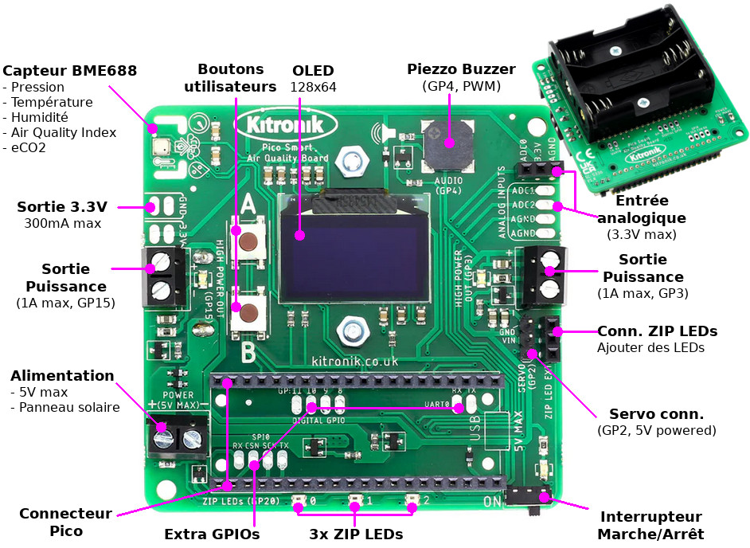

# Kitronik-Pico-Smart-Air-Quality-Board-MicroPython

__Crédit:__ le fichier [README](README.md) est traduit par [MCHobby](https://shop.mchobby.be) - the [README](README.md) file is translated by [MCHobby](https://shop.mc



Module et code d'exemple pour la carte Raspberry Pi Pico Smart Air Quality de Kitronik (www.kitronik.co.uk/5336).

Pour utiliser votre carte, sauvez le fichier `PicoAirQuality.py` sur votre Pico pour qu'il puisse être importé.  
Il y a plusieurs classes dans ce module qui offrent l'accès (et le contrôle) aux différentes fonctionnalités de la carte.
## Importer PicoAirQuality et créer les objets:
```python
from PicoAirQuality import KitronikBME688, KitronikOLED, KitronikRTC, KitronikZIPLEDs, KitronikBuzzer, KitronikDataLogger, KitronikOutputControl, KitronikButton

bme688 = KitronikBME688()    # Classe pour le BME688 - capteur environmental et qualité d'air
oled = KitronikOLED()    # Classe pour utiliser l'afficheur OLED
rtc = KitronikRTC()    # Classe pour utiliser l'horloge RTC interne du Pico (RTC)
zipleds = KitronikZIPLEDs(3)    # Classe pour utiliser les LEDs ZIP (sur la carte et connexion externe)
buzzer = KitronikBuzzer()    # Classe pour le Piezzo Buzzer
log = KitronikDataLogger("data_log.txt", "semicolon")    # Classe pour faire du DataLogging sur le système de fichier MicroPython
output = KitronikOutputControl()    # Classe pour utiliser les sortie forte puissance et sortie servo
buttons = KitronikButton()    # Classe pour utiliser les boutons d'entrées
```
Ci-dessous les explications des différentes fonctions disponibles dans chaque classe

## Classe KitronikBME688
Le capteur BME688 est la principale fonctionnalité de la carte et permet de mesurer:  
* Température
* Pression
* Humidité
* Index de Qualité d'Air (IAQ)
* Estimation CO2 (eCO2)

L'instanciation de la classe extrait les paramètres de calibration et les appliques aux différents calculs. C'est également à moment que les variables nécessaires sont créées et que le paramétrage par défaut est appliqué au capteur BME688.  
Après cet instanciation, la température, pression et humidité peuvent être immédiatement mesurés, mais le capteur de gaz - utilisé pour les mesure de IAQ et eCO2 - nécessite une initialisation complémentaire:  
```python
bme688.setupGasSensor()
bme688.calcBaselines()
```
Ces méthodes fixe la température et temps d'activation de l'élément chauffant du capteur gaz. Ensuite, il exécute un processus de 5 minutes qui mesure la résistance du capteur Gaz et la température ambiante pour, ensuite, calculer des valeurs moyennes - ces valeurs sont ensuite utilisés comme _baselines_ (valeurs de base) pour les calculs à venir.

Pour déclencher une mesure, appeler:  
```python
bme688.measureData()
```
Cette fonction capture les différentes mesures des capteurs composant le BME688 puis effectue les calculs de compensations nécessaires. Pour obtenir les différentes valeurs dans votre script, dans un format utilisable, il faut alors faire appel aux méthodes suivantes:  
```python
bme688.readTemperature(temperature_unit="C")    # Température, en degrés Celcius (par défaut). "F" pour des degrés Fahrenheit.
bme688.readPressure(pressure_unit="Pa")         # Pression, en Pascals (par défaut). "mBar" pour utiliser des millibar.
bme688.readHumidity()       # Humidité relative en %.
bme688.readeCO2()       # CO2 equivalent basé sur la résistance du capteur gaz, la température et l'humidité. Valeur en ppm (Part Par Million)..
bme688.getAirQualityPercent()   # Qualité de l'air en %. Valeur relative basée sur la résistance du capteur gaz et l'humidité.
bme688.getAirQualityScore()     # Score du qualité d'air. Valeur relative basée sur la résistance du capteur gaz et l'humidité. Valeur de 0 (excellent) à 500 (extrêmement pauvre).
```

## Classe KitronikOLED
L'écran OLED permet d'ajouter un retour visuel aux programmes et projets. L'écran peut afficher du texte, des chiffres, des lignes, des formes et des graphiques simples.  
L'instanciation de la classe initialise la configuration de l'écran, avec une orientation correcte de l'affichage (le Pico situé vers le bas de la carte).  

Pour afficher du texte (ou des nombres convertis en texte avec 'str(*numbers*)'):  
```python
oled.displayText(text, line, x_offset=0) # Texte, Ligne, Décalage_x
```
Le texte peut être affiché sur n'importe laquelle des 6 lignes (de 1 à 6), avec un maximum de 16 caractères par ligne. Par défaut, le texte est affiché à partie de la bordure gauche de l'écran. En précisant le paramètre `x_offset` avec une quantité de pixels, l'affichage du texte peut être décalé horizontalement sur l'écran (qui fait 128px de large).

**Note:** Si le texte est trop long pour être affiché sur la ligne alors les caractères excédentaires seront coupés (il n'y a pas de retour à la ligne).  

Pour que les modifications apparaissent sur l'écran, il faut appeler la méthode `show()`:  
```python
oled.show()
```

La méthode `show()` doit être appelée pour rendre toute modification visible sur l'écran. Elle doit donc être appelée après:  
* displayText() # Afficher du texte
* drawLine() # Dessiner une ligne
* drawRect() # Dessiner un rectangle
* plot()    # Dessiner
* clear()  # Effacer l'écran

L'affichage d'une ligne commence au coordonnées (x, y) jusqu'aux coordonnées de fin (x, y):  
```python
oled.drawLine(start_x, start_y, end_x, end_y) # depart_x, depart_y, fin_x, fin_y
```
**Note:** l'écran fait 128px de large et 64px de haut.

Pour dessiner un rectangle:  
```python
oled.drawRect(start_x, start_y, width, height, fill=False) # depart_x, depart_y, largeur, hauteur, remplissage
```
Les coordonnées de départ (x, y) sont toujours référencées à partir du coin supérieur-gauche. Ensuite, nous indiquons la largeur (_width_) et la hauteur (_height_) en pixels. Par défaut, seuls les bords du rectangle sont dessinés. Il est possible de remplir le rectangle en précisant le paramètre `fill=True`.  


Pour dessiner un graphe (à une variable unique):
```python
oled.plot(variable)
```
Si la méthode est répétitivement appelée (par exemple, dans une boucle `while True`) alors la variable (contenant la lecture d'un capteur) peut être dessinée en temps réel sur l'écran OLED. La ligne supérieure de l'écran reste disponible pour ajouter du texte (ou graphique).

Pour effacer l'écran (et les données mémorisées dans la mémoire tampon):  
```python
oled.clear()
```
Pour éteindre l'écran (sans perte des données d'affichage):
```python
oled.poweroff()
```
Pour rallumer l'écran (réaffiche le contenu précédemment connu):  
```python
oled.poweron()
```

Pour modifier le contraste du graphique affiché par rapport au fond (ex: rendre les choses plus brillante ou plus sombre):  
```python
oled.contrast(contrast)     # 0 = faible à 150 = lumineux
```

Pour inverser les couleurs de l'affichage (inverser les couleurs de fond et de premier plan):
```python
oled.invert(invert)     # 0 = Blanc sur noir, 1 = Noir sur blanc
```

## Classe KitronikRTC
Le Pico dispose d'une horloge temps réel (dite RTC pour _Real-Time Clock_) disposant d'une interface très simple permettant à l'utilisateur de fixer la date puis, alors que le temps s'égraine, d'interroger la RTC pour obtenir date et heure.
La classe KitronikRTC étant cette fonctionnalité en permettant: de séparer l'initialisation de la date et/ou du temps, obtention de la date et heure sous forme de chaiîne de caractères, lecture individuel des paramètres de date et heure, possibilité de fixer une alarme.

Fixer la date et heure:  
```python
rtc.setDate(day, month, year) # Fixer la date en jour, mois, années
rtc.setTime(hours, minutes, seconds) # Fixer l'heure en heures, minutes, secondes
```

Obtenir la date ou l'heure sous forme de chaîne de caractères:  
```python
rtc.readDateString()    # DD/MM/YY pour Jour/Mois/Années
rtc.readTimeString()    # HH:MM:SS pour Heure:Minutes:Secondes
```

Obtention des des éléments individuels composants la date et heure:  
```python
rtc.readParameter(parametre)
```
Où 'parametre' peut être:  
* 'd' = jours (_Day_)
* 'm' = mois (_Month_)
* 'y' = années (_Year_)
* 'h' = heures (_Hour_)
* 'min' = minutes (_Minute_)
* 's' = secondes (_Second_)

Pour fixer une alarme:
```python
rtc.setAlarm(hour, minute) # Heure, Minute
```
Pour vérifier si les conditions d'alarme sont rencontrées - cette méthode retourne `True` si l'alarme est déclenchée:  
```python
rtc.checkAlarm()
```
Désactive l'alarme lorsque celle-ci à été déclenchée:  
```python
rtc.silenceAlarm()
```

## Classe KitronikZIPLEDs
Les LEDs ZIP fonctionnent en deux étapes...
### Initialiser les LEDs ZIP:  
Fixer la couleur souhaitée sur une LEDs:  
```python
zipleds.setLED(whichLED, whichColour) # Quelle_LED, Quelle_couleur
```
Où:  
* whichLED => indique la LED de 0 à 2 (pour les LEDs sur la carte). S'il y a plus de LEDs ZIP connectés sur l'extension ZIP LED alors le nombre total de LEDs doit être mentionné lors de l'instantiation de la classe)  
* whichColour => indique la couleur souhaitée à l'aide d'un tuple (valeur_rouge, valeur_vert, valeur_bleu) ou à l'aide d'une des couleurs prédéfinies:
```python
# Couleur = BLACK=Noir, RED=Rouge, YELLOW=Jaune, GREEN=Vert,
# CYAN=Cyan, BLUE=Bleu, PURPLE=Pourpre, WHITE=Blanc
COLOURS = (BLACK, RED, YELLOW, GREEN, CYAN, BLUE, PURPLE, WHITE)
```

Désactiver/effacer une LEDs:
```python
zipleds.clear(whichLED) # Quelle_LED
```
Où:  
* whichLED => indique la LED de 0 à 2 pour les LEDs présentes sur la carte

Contrôle de la luminosité:
```python
zipleds.setBrightness(value)
```
Où:  
* value => valeur de la luminosité de 0 à 100 (Luminosité en %)

### Rendre les modifications visibles:
```python
zipleds.show():
```

## Classe KitronikBuzzer
Le Piezo buzzer présent sur la carte peut produire un tonalité simple (une fréquence audible), avec tonalité et durée à l'aide des méthodes décrites ci-dessous.

Produire une tonalité (en continu) en fixant sa fréquence dans la gamme 30 Hz à 3 kHz (3000 Hz):  
```python
buzzer.playTone(freq)
```
Joue une tonalité à la fréquence désignée durant durée mentionnée (en millisecondes):  
```python
buzzer.playTone_Length(freq, length) # Frequence, Durée
```

Cesser la tonalité:  
```python
buzzer.stopTone()
```

## Classe KitronikDataLogger
Le data logging fait partie des fonctionnalités de base de la carte et permet de capturer les données des capteurs en vue d'une analyse ou manipulation ultérieure.  
Le fichier est crée lors de l'instanciation de la classe, le nom du fichier et séparateur de champs sont communiqués lors de l'instanciation:  
```python
log = KitronikDataLogger(filename, separator) # nom_de_fichier, séparateur
```
Il existe trois options pour le séparateur de données:  
* "comma" = pour une virgule `,`
* "semicolon" = pour un point-virgule `;`
* "tab" = pour des espaces '&nbsp;&nbsp;&nbsp;&nbsp;'

Il existe deux méthodes permettant d'ajouter des informations complémentaires dans le fichier de log:  
```python
# Information projet - ligne1, ligne2, ligne 3
log.writeProjectInfo(line1, line2, line3)
# Noms des colonnes - champs de 1 à 10
log.nameColumnHeadings(field1, field2, field3, field4, field5, field6, field7, field8, field9, field10)
```
La première méthode permet d'ajouter jusqu'à 3 lignes de texte contenant des informations utilisateurs (si deux paramètres sont communiqués alors seulement deux ligne seront écrites).  
La seconde méthode permet à l'utilisateur d'indiquer une ligne d'entête avec le nom des colonnes (jusqu'à 10 entrées) qui peut correspondre à l'ordre des champs de données qui seront écrit dans le fichier (cette entête deviendra l'entête des colonnes lorsque les données seront importées dans une feuille de calcul).  
Avec ces méthodes appelées, le début dy fichier de log peu ressembler à ceci:  
```
Kitronik Data Logger - Pico Smart Air Quality Board - www.kitronik.co.uk
Name: User Name
Subject: Project 1
Date;Time;Temperature;Pressure;Humidity;Soil Moisture;IAQ;eCO2;
```
Il faut utiliser la méthode suivante pour ajouter des données dans le fichier de log:  
```python
log.storeDataEntry(field1, field2, field3, field4, field5, field6, field7, field8, field9, field10)
```
**Note:** Les données doivent être saisies sous forme de chaîne de caractères (les nombres doivent être convertis avec `str(valeur_numerique)` ).  
Il y a 10 champs disponibles par ligne de données. Cela permet, par exemple, de créer un enregistrement: `Date, Heure, Température, Pression, Humidité, IAQ, eCO2` avec encore assez de place pour 3 données de capteurs externes.  
La taille maximale du fichier de log est de 500 Kio de sorte qu'il reste toujours assez de place dans la Flash du Pico pour vos propres programmes. Si le fichier dépasse la taille limite lors de l'ajout de nouvelles données alors une partie des données les plus anciennes sont effacées pour faire de la place pour les nouvelles écritures.  

Il y a deux options pour effacer des données stockées sur le Pico.  
Le contenu du fichier peut être vidé:  
```python
logeraseAllData()
```
Ou le fichier de données peut être effacé:  
```python
 log.deleteDataFile()
 ```

## Classe KitronikOutputControl
### Servo moteur:
Un servo PWM (répétition 20ms, cycle utile de 500 à 2500us) est contrôlé à l'aide de PIO.  

Pour déclarer (enregister) un servo-moteur prêt à être utilisé:  
```python
 output.registerServo()
```
Cela active le générateur PWM PIO sur la broche servo (**Note:** le servo moteur est déclaré par défaut).  
Le positionnement angulaire de l'axe du servo-moteur (ou contrôle de la vitesse et sens de rotation d'un servo à rotation continue) se fait avec:  
```python
output.servoToPosition(degrees) # Degrés entre 0 et 180
```
Si la broche du servo moteur est nécessaire pour un autre usage, il est possible de détacher/désenregistrer le générateur PIO PWM de la broche (désactive le PIO):  
 ```python
output.deregisterServo()
 ```

### Sorties de  puissance:
Les sorties de puissances sur la carte (1 Amp max) sont contrôlées à l'aide de deux broches du Pico: GP3 et GP15.  

Le contrôle de ces sorties est vraiment simple, les sorties peuvent être activées (_On_) ou désactivées (_Off_):  
```python
output.highPowerOn(pin) # broche, activer la sortie
output.highPowerOff(pin) # broche, désactiver la sortie
```
Où:
* pin = sortie a activer/désactiver (3 ou 15)  

## KitronikButton
A l'instanciation de la classe, les deux boutons (objets `buttonA` et `buttonB`) sont créés et accessibles pour le programme principale.  

Une méthode d'utilisation des boutons est l'interruption (IRQ) accompagné de sa fonction d'interruption (dit _interrupt handlers_) - L'exemple ci-dessous indique comment utiliser cette méthode.  
### Interruptions boutons (IRQ):
```python
buttons.buttonA.irq(trigger=machine.Pin.IRQ_RISING, handler=ButtonA_IRQHandler)
buttons.buttonB.irq(trigger=machine.Pin.IRQ_RISING, handler=ButtonB_IRQHandler)
```
### fonctions d'interruption des boutons:
```python
def ButtonA_IRQHandler(pin):
    oled.clear()
    bme688.measureData()
    oled.displayText(rtc.readDateString(), 1)
    oled.displayText(rtc.readTimeString(), 2)
    oled.displayText("T: " + str(bme688.readTemperature()), 4)
    oled.displayText("IAQ: " + str(bme688.getAirQualityScore()), 5)
    oled.displayText("eCO2: " + str(bme688.readeCO2()), 6)
    oled.show()

def ButtonB_IRQHandler(pin):
    oled.clear()
    oled.show()
```

# Dépannage

Ce code est conçu pour être utilisé comme un module python .  
Voyez: https://kitronik.co.uk/blogs/resources/modules-micro-python-and-the-raspberry-pi-pico pour plus d'information.  
